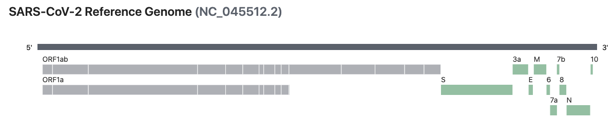

Table of Contents
=================

* [Table of Contents](#table-of-contents)
   * [README](#readme)
   * [Tools](#tools)
   * [Sequences](#sequences)
      * [Reference sequence](#reference-sequence)
      * [Variants](#variants)
         * [Omicron](#omicron)
      * [Genomes](#genomes)
      * [Proteins](#proteins)
      * [Nucleotide sequences](#nucleotide-sequences)
   * [Identifying variants in lineages](#identifying-variants-in-lineages)
   * [BLAST](#blast)
   * [Parse results](#parse-results)
   * [ClustalW](#clustalw)
   * [SRA](#sra)
      * [SRR10971381](#srr10971381)
   * [Links](#links)
   * [Appendix](#appendix)
      * [Entrez Direct Functions](#entrez-direct-functions)

Created by [gh-md-toc](https://github.com/ekalinin/github-markdown-toc)

## README


The [Severe acute respiratory syndrome coronavirus 2 (SARS-CoV-2)](https://en.wikipedia.org/wiki/Severe_acute_respiratory_syndrome_coronavirus_2) is an RNA virus currently causing the 2019–20 coronavirus pandemic. This repository contains my analysis code and notes for my analysis of SARS-CoV-2. My hope is that some of this work will be useful for researchers currently working on the analysis of SARS-CoV-2.

For more information see my related blog posts:

1. https://davetang.org/muse/2020/03/05/sequence-analysis-sars-cov-2/
2. https://davetang.org/muse/2020/03/06/sequence-analysis-of-sars-cov-2-part-2/
3. https://davetang.org/muse/2020/03/12/sequence-analysis-of-sars-cov-2-part-3/
4. https://davetang.org/muse/2022/01/26/omicron-variants/ (this analysis workflow is also implemented as a [GitHub Actions workflow](https://github.com/davetang/sars_cov_2/blob/master/.github/workflows/omicron_variants.yml))

## Tools

I rely on Conda (a lot) to install the tools needed to perform my analyses. I have written a [short introduction to Conda](https://davetang.github.io/reproducible_bioinformatics/conda.html) that may be useful if you have never used it before. Please install [Miniconda](https://docs.conda.io/en/latest/miniconda.html) if you haven't already. Once you have Conda, run the command below to install all the necessary tools.

Install [Mamba](https://github.com/mamba-org/mamba) first.

```bash
conda install mamba -n base -c conda-forge
```

Use Mamba to create environment.

```bash
mamba env create --file environment.yml

conda activate sars_cov_2
```

The [NCBI Datasets project](https://github.com/ncbi/datasets) has developed a command-line tool, `datasets`, that is used to query and download biological sequence data across all domains of life from NCBI databases.

```bash
wget https://ftp.ncbi.nlm.nih.gov/pub/datasets/command-line/LATEST/linux-amd64/datasets -O bin/datasets
chmod 755 bin/datasets
```

[SnpEff](https://pcingola.github.io/SnpEff/).

```bash
cd bin
wget https://snpeff.blob.core.windows.net/versions/snpEff_latest_core.zip
unzip snpEff_latest_core.zip
cd snpEff
java -jar snpEff.jar download NC_045512.2
```

The script `bin/download.sh` will attempt to download `datasets`, `dataformat`, and `snpEff`.

## Sequences

### Reference sequence

[Reference sequence](https://www.ncbi.nlm.nih.gov/sars-cov-2/) NC_045512. Download GFF for NC_045512 from https://www.ncbi.nlm.nih.gov/sars-cov-2/.

```bash
mkdir tmp && cd tmp
../bin/macos/datasets download genome accession GCF_009858895.2 --filename GCF_009858895.2.zip --include-gbff --include-gtf
unzip GCF_009858895.2.zip

gzip ncbi_dataset/data/GCF_009858895.2/GCF_009858895.2_ASM985889v3_genomic.fna
mv ncbi_dataset/data/GCF_009858895.2/GCF_009858895.2_ASM985889v3_genomic.fna.gz ../raw
cd .. && rm -rf tmp
```

### Variants

See [SARS-CoV-2 Variant Classifications and Definitions](https://www.cdc.gov/coronavirus/2019-ncov/variants/variant-info.html) and https://www.ncbi.nlm.nih.gov/pmc/articles/PMC8342008/ for more information.

Download [variants of concern](https://ncbiinsights.ncbi.nlm.nih.gov/2021/04/23/data-sars-cov-2-variants/) using `script/download_variants.sh`. The script will keep trying to download a [lineage](https://cov-lineages.org/lineage_list.html) until successful; this was implemented because for variants with a lot of sequences (Alpha and Delta), the download would disconnect quite often (despite having a very fast Internet connection).

* Alpha (B.1.1.7)
* Beta (B.1.351, B.1.351.2, B.1.351.3)
* Delta (B.1.617.2, AY.1, AY.2, AY.3)
* Gamma (P.1, P.1.1, P.1.2)
* Omicron (B.1.1.529, BA.1, BA.2, BA.3)

Summarise using `dataformat`.

```bash
bin/macos/dataformat tsv virus-genome --package raw/variants/SARS-CoV-2-P.1.1.20210819.zip --fields accession,virus-pangolin,release-date,isolate-lineage | head -5
Accession       Virus Pangolin Classification   Release date    Isolate Lineage
MZ799138.1      P.1.1   2021-08-15      SARS-CoV-2/human/USA/2105200446/2021
MZ788313.1      P.1.1   2021-08-13      SARS-CoV-2/human/USA/TX-DSHS-7363/2021
MZ770359.1      P.1.1   2021-08-12      SARS-CoV-2/human/USA/UT-UPHL-210729378097/2021
MZ746322.1      P.1.1   2021-08-10      SARS-CoV-2/human/USA/UT-UPHL-210729378097/2021

# confirm that accession MZ157012 is a delta variant
bin/macos/dataformat tsv virus-genome --package raw/variants/SARS-CoV-2-B.1.617.2.20210819.zip --fields accession,virus-pangolin,release-date,isolate-lineage | grep MZ157012
MZ157012.1      B.1.617.2       2021-05-11      SARS-CoV-2/human/NPL/LMB11/2021
```

Count number of sequences per lineage.

```bash
for file in $(ls raw/variants/*.zip); do
   echo ${file};
   bin/macos/dataformat tsv virus-genome --package ${file} | wc -l
done

raw/variants/SARS-CoV-2-AY.1.20210819.zip
     254
raw/variants/SARS-CoV-2-AY.2.20210819.zip
    1036
raw/variants/SARS-CoV-2-AY.3.20210819.zip
    5678
raw/variants/SARS-CoV-2-B.1.1.7.20210819.zip
  467304
raw/variants/SARS-CoV-2-B.1.351.2.20210819.zip
      47
raw/variants/SARS-CoV-2-B.1.351.20210819.zip
    4311
raw/variants/SARS-CoV-2-B.1.351.3.20210819.zip
     340
raw/variants/SARS-CoV-2-B.1.617.2.20210819.zip
  152212
raw/variants/SARS-CoV-2-P.1.1.20210819.zip
    1004
raw/variants/SARS-CoV-2-P.1.2.20210819.zip
     746
raw/variants/SARS-CoV-2-P.1.20210819.zip
   16109
```

#### Omicron

BA.1.

```bash
bin/macos/dataformat tsv virus-genome --package raw/variants/SARS-CoV-2-BA.1.20220225.zip --fields accession,virus-pangolin,release-date,isolate-lineage,geo-location | head -5
Accession	Virus Pangolin Classification	Release date	Isolate Lineage	Geographic location
OL815078.1	BA.1	2021-12-11	SARS-CoV-2/human/USA/NY-CDC-IBX854867598434/2021	USA: New York
OL808790.1	BA.1	2021-12-10	SARS-CoV-2/human/USA/MA-MGB-02636/2021	USA: Massachusetts
OL802692.1	BA.1	2021-12-10	SARS-CoV-2/human/USA/NY-CDCBI-CRSP_GHHFUDBUXELXFY54/2021	USA: New York
OL800703.1	BA.1	2021-12-10	SARS-CoV-2/human/DEU/FFM-ZAF0396/2021	Germany: Hesse

bin/macos/dataformat tsv virus-genome --package raw/variants/SARS-CoV-2-BA.1.20220225.zip | wc -l
8792232
```

BA.2.

```bash
bin/macos/dataformat tsv virus-genome --package raw/variants/SARS-CoV-2-BA.2.20220225.zip --fields accession,virus-pangolin,release-date,isolate-lineage,geo-location | head -5
Accession	Virus Pangolin Classification	Release date	Isolate Lineage	Geographic location
OM364005.1	BA.2	2022-01-24	SARS-CoV-2/human/USA/WA-S16397/2022	USA: Washington,King County
OM362060.1	BA.2	2022-01-24	SARS-CoV-2/human/USA/NY-CDC-LC0466930/2022	USA: New York
OM354922.1	BA.2	2022-01-24	SARS-CoV-2/human/USA/CA-CDC-STM-X4Q4J65PP/2022	USA: California
OM349979.1	BA.2	2022-01-24	SARS-CoV-2/human/IND/MH-ICMR-NIV-INSACOG-GSEQ-7029/2021	India

bin/macos/dataformat tsv virus-genome --package raw/variants/SARS-CoV-2-BA.2.20220225.zip | wc -l
   97503

bin/macos/dataformat tsv virus-genome --package raw/variants/SARS-CoV-2-BA.2.20220225.zip --fields geo-location | grep -v "^Geographic" | cut -f1 -d':' | sort | uniq -c | sort -k1rn
6896 United Kingdom
1623 USA
 301 Switzerland
  50 Germany
  32 Bangladesh
  30 Denmark
  25 Slovakia
  18 South Africa
  16 Bahrain
   5 China
   4 Austria
   3 Japan
   1 India

bin/macos/dataformat tsv virus-genome --package raw/variants/SARS-CoV-2-BA.2.20220225.zip --fields accession,virus-pangolin,release-date,isolate-lineage,geo-location | grep Japan
BS002318.1	BA.2	2022-01-26	hCoV-19/Japan/SZ-NIG-4-C118/2022	Japan:Shizuoka, Hamamatsu
BS002317.1	BA.2	2022-01-26	hCoV-19/Japan/SZ-NIG-4-C117/2022	Japan:Shizuoka, Hamamatsu
BS002303.1	BA.2	2022-01-26	hCoV-19/Japan/SZ-NIG-4-C67/2022	Japan:Shizuoka, Hamamatsu
```

### Genomes

Download [Coronavirus genomes](https://www.ncbi.nlm.nih.gov/datasets/coronavirus/genomes/) using `datasets`.

```bash
mkdir -p raw/genome
today=$(date +%Y%m%d)
bin/datasets download virus genome tax-name sars2 --filename raw/genome/sars2.${today}.zip
```

973,966 genome sequences as of Thu Jul 22 17:37:22 JST 2021 up from 7,031 genome sequences from Mon Jul 20 14:32:46 JST 2020.

```bash
cd raw/genome/
unzip sars2.20210722.zip

cat ncbi_dataset/data/genomic.fna | grep "^>" | wc -l
973966
```

Look for [MN908947](https://www.ncbi.nlm.nih.gov/nuccore/MN908947).

```bash
cat ncbi_dataset/data/genomic.fna | grep MN908947
>MN908947.3 Severe acute respiratory syndrome coronavirus 2 isolate Wuhan-Hu-1, complete genome
>MT576029.1 Severe acute respiratory syndrome coronavirus 2 isolate SARS-CoV-2/human/ESP/2019-nCoV-MN908947-cOVID-96_19/2020, complete genome
```

Look for [MZ157012](https://www.ncbi.nlm.nih.gov/nuccore/MZ157012) (an isolate from lineage B.1.617.2 or also known as the Delta variant).

```bash
cat ncbi_dataset/data/genomic.fna | grep MZ157012
>MZ157012.1 Severe acute respiratory syndrome coronavirus 2 isolate SARS-CoV-2/human/NPL/LMB11/2021 ORF1ab polyprotein (ORF1ab) gene, partial cds; ORF1a polyprotein (ORF1ab) gene, complete cds; surface glycoprotein (S) and ORF3a protein (ORF3a) genes, partial cds; envelope protein (E), membrane glycoprotein (M), and ORF6 protein (ORF6) genes, complete cds; ORF7a protein (ORF7a) gene, partial cds; ORF8 gene, partial sequence; and nucleocapsid phosphoprotein (N) gene, partial cds
```

Extract MN908947.3 and MZ157012.1.

```bash
echo -e "MN908947.3\nMZ157012.1" > raw/wanted.txt

bin/seqtk subseq raw/genome/ncbi_dataset/data/genomic.fna raw/wanted.txt > raw/wanted.fa
```

### Proteins

The `download virus protein` [command](https://www.ncbi.nlm.nih.gov/datasets/docs/command-line-virus/) downloads [complete protein sequences](https://www.ncbi.nlm.nih.gov/datasets/coronavirus/proteins/) (excluding partial sequences) and annotation data as a zip file in the BDBag (Big Data Bag) format.

```bash
bin/datasets download virus protein S --filename raw/SARS2-spike.zip
```

The default protein dataset for a given protein includes the following for all complete SARS2 RefSeq and GenBank genomes:

* amino acid sequences in FASTA (.faa) format
* protein structures in PDB (.pdb) format
* nucleotide coding (CDS) sequences in FASTA (.fna) format
* data report containing taxonomy, isolate, host and other metadata (`data_report.yaml`)
* annotation and amino acid sequences in the GenPept flat file format (`protein.gpff`)
* a README containing details on sequence file data content and other general information (`virus_dataset.md`)
* a list of files and file types (`dataset_catalog.json`)

```bash
|-- ncbi_dataset
|   |-- bag-info.txt
|   |-- bagit.txt
|   |-- data
|   |   |-- cds.fna
|   |   |-- data_report.yaml
|   |   |-- dataset_catalog.json
|   |   |-- pdb
|   |   |   |-- 6VYB.pdb
|   |   |   |-- 6VYO.pdb
|   |   |   |-- 6W37.pdb
|   |   |   |-- 6W4H.pdb
|   |   |   |-- 6W9C.pdb
|   |   |   |-- 6W9Q.pdb
|   |   |   |-- 6WEY.pdb
|   |   |   |-- 6WJI.pdb
|   |   |   |-- 6WLC.pdb
|   |   |   |-- 7BQY.pdb
|   |   |   `-- 7BV2.pdb
|   |   |-- protein.faa
|   |   |-- protein.gpff
|   |   `-- virus_dataset.md
|   |-- fetch.txt
|   |-- manifest-md5.txt
|   `-- tagmanifest-md5.txt
`-- README.md
```

Extract only the amino acid FASTA sequences.

```bash
for file in $(ls raw/protein/SARS2*.zip); do
   base=$(basename $file .zip);
   unzip -jp $file ncbi_dataset/data/protein.faa | gzip > raw/protein/${base}.faa.gz
done

zcat raw/protein/SARS2.20200720.S.faa.gz | grep "^>" | wc -l
7015
```

Number of unique sequences.



```bash
for file in $(ls raw/protein/*.faa.gz); do
   echo $file;
   script/unique_seq.pl -f $file | wc -l;
done

raw/protein/SARS2.20200720.E.faa.gz
30
raw/protein/SARS2.20200720.M.faa.gz
95
raw/protein/SARS2.20200720.N.faa.gz
360
raw/protein/SARS2.20200720.nsp10.faa.gz
36
raw/protein/SARS2.20200720.nsp11.faa.gz
7
raw/protein/SARS2.20200720.nsp13.faa.gz
254
raw/protein/SARS2.20200720.nsp14.faa.gz
307
raw/protein/SARS2.20200720.nsp15.faa.gz
166
raw/protein/SARS2.20200720.nsp16.faa.gz
146
raw/protein/SARS2.20200720.nsp1.faa.gz
134
raw/protein/SARS2.20200720.nsp2.faa.gz
388
raw/protein/SARS2.20200720.nsp3.faa.gz
862
raw/protein/SARS2.20200720.nsp4.faa.gz
198
raw/protein/SARS2.20200720.nsp5.faa.gz
118
raw/protein/SARS2.20200720.nsp6.faa.gz
120
raw/protein/SARS2.20200720.nsp7.faa.gz
31
raw/protein/SARS2.20200720.nsp8.faa.gz
69
raw/protein/SARS2.20200720.nsp9.faa.gz
48
raw/protein/SARS2.20200720.ORF10.faa.gz
28
raw/protein/SARS2.20200720.orf1ab.faa.gz
5773
raw/protein/SARS2.20200720.orf1a.faa.gz
3756
raw/protein/SARS2.20200720.ORF3a.faa.gz
290
raw/protein/SARS2.20200720.ORF6.faa.gz
58
raw/protein/SARS2.20200720.ORF7a.faa.gz
88
raw/protein/SARS2.20200720.ORF7b.faa.gz
1
raw/protein/SARS2.20200720.ORF8.faa.gz
99
raw/protein/SARS2.20200720.RdRp.faa.gz
342
raw/protein/SARS2.20200720.S.faa.gz
779
```

### Nucleotide sequences

The page https://www.ncbi.nlm.nih.gov/genbank/sars-cov-2-seqs/ contains a list of SARS-CoV-2 sequences. Download latest list of SARS-CoV-2 nucleotide sequence IDs.

```bash
outfile=acc.$(date +%F).txt.gz
wget https://www.ncbi.nlm.nih.gov/sars-cov-2/download-nuccore-ids/ -O - | gzip > raw/$outfile

zcat raw/$outfile | wc -l
10001
```

We can use `efetch` to download an [assembled SARS-CoV-2 genome sequence](https://www.ncbi.nlm.nih.gov/nuccore/MN908947) in various formats.

```bash
mkdir raw

efetch -db sequences -format genbank -id MN908947 > raw/MN908947.genbank
efetch -db sequences -format fasta -id MN908947 > raw/MN908947.fa
efetch -db sequences -format fasta_cds_aa -id MN908947
```

We can use `esearch` to query the number of sequences associated with the term "coronavirus". There were 41,874 results as of 2020/03/01.

```bash
esearch -db nuccore -query coronavirus
<ENTREZ_DIRECT>
  <Db>nuccore</Db>
  <WebEnv>NCID_1_121026101_130.14.22.33_9001_1583054896_904858778_0MetA0_S_MegaStore</WebEnv>
  <QueryKey>1</QueryKey>
  <Count>41874</Count>
  <Step>1</Step>
</ENTREZ_DIRECT>
```

We can pipe the output from `esearch` to `efetch` to fetch all sequences.

```bash
today=$(date "+%Y%m%d")

time esearch -db nuccore -query coronavirus | efetch -db sequences -format fasta > raw/coronavirus_$today.fa

real    10m39.511s
user    0m53.739s
sys     0m7.705s

cat raw/coronavirus_$today.fa | grep "^>" | wc -l
   43581

cat raw/coronavirus_$today.fa | grep MN908947
>MN908947.3 Severe acute respiratory syndrome coronavirus 2 isolate Wuhan-Hu-1, complete genome
```

I wrote a simple Perl script to calculate the length of the FASTA sequences.

```bash
today=$(date "+%Y%m%d")
script/fasta_stats.pl -f raw/coronavirus_$today.fa | gzip > result/coronavirus_${today}_stat.txt.gz
```

## Identifying variants in lineages

The [SARS-CoV-2 Delta variant](https://en.wikipedia.org/wiki/SARS-CoV-2_Delta_variant) is a variant of lineage B.1.617 of SARS-CoV-2; it belongs to lineage B.1.617.2. It has mutations in the gene encoding the SARS-CoV-2 spike protein causing the substitutions T478K, P681R and L452R. The workflow below will download the FASTA sequence of one particular Delta variant (accession MZ157012), align it with the SARS-CoV-2 reference sequence, generate a VCF file based on the alignment, and finally annotate the differences to the reference sequence.

```bash
id=MZ157012
efetch -db sequences -format fasta -id ${id} | gzip > raw/${id}.fa.gz
gunzip -c raw/GCF_009858895.2_ASM985889v3_genomic.fna.gz raw/MZ157012.fa.gz | gzip > raw/ref_vs_delta.fa.gz
gunzip -c raw/ref_vs_delta.fa.gz | muscle -out raw/ref_vs_delta.aln.fa
snp-sites -v -o raw/ref_vs_delta.vcf raw/ref_vs_delta.aln.fa
cat raw/ref_vs_delta.vcf | sed 's/ID=1/ID=NC_045512.2/;s/^1/NC_045512.2/' > blah
mv -f blah raw/ref_vs_delta.vcf
java -Xmx8g -jar bin/snpEff/snpEff.jar NC_045512.2 raw/ref_vs_delta.vcf > raw/ref_vs_delta.ann.vcf 
```

There are four mutations in the spike protein in MZ157012; two intersect with the reported substitutions in the Wikipedia article: L452R and T478K but P681R was not found.

```bash
cat raw/ref_vs_delta.ann.vcf | perl -nle 'next if /^#/; @s=split(/\|/); next unless $s[3] eq "S"; print $s[10]' 
p.Leu452Arg
p.Thr478Lys
p.Asp614Gly
p.Asp950Asn
```

The above workflow can be run by using `script/var_to_vcf.sh`; make sure you activate the Conda environment before running the script. We will use the script to generate VCF files for BA.1 (OL815078) and BA.2 (OM364005) variants.

```bash
script/var_to_vcf.sh -i OL815078

cat raw/ref_vs_OL815078.ann.vcf | perl -nle 'next if /^#/; @s=split(/\|/); next unless $s[3] eq "S"; print $s[10]'
p.Ala67Val
p.Thr95Ile
p.Gly339Asp
p.Ser371Pro
p.Ser371Phe
p.Ser373Pro
p.Ser375Phe
p.Lys417Asn
p.Thr547Lys
p.Asp614Gly
p.His655Tyr
p.Asn679Lys
p.Pro681His
p.Ala701Val
p.Asn764Lys
p.Asp796Tyr
p.Asn856Lys
p.Gln954His
p.Asn969Lys
p.Leu981Phe
p.Asp1146Asp

script/var_to_vcf.sh -i OM364005
cat raw/ref_vs_OM364005.ann.vcf | perl -nle 'next if /^#/; @s=split(/\|/); next unless $s[3] eq "S"; print $s[10]'
p.Thr19Ile
p.Gly142Asp
p.Val213Gly
p.Gly339Asp
p.Ser371Phe
p.Ser373Pro
p.Ser375Phe
p.Thr376Ala
p.Asp405Asn
p.Arg408Ser
p.Lys417Asn
p.Asn440Lys
p.Ser477Asn
p.Thr478Lys
p.Glu484Ala
p.Gln493Arg
p.Gln498Arg
p.Asn501Tyr
p.Tyr505His
p.Asp614Gly
p.His655Tyr
p.Asn679Lys
p.Pro681His
p.Asn764Lys
p.Asp796Tyr
p.Gln954His
p.Asn969Lys
p.Asn1023Ser
p.Asp1146Asp
```

Spike protein variants specific to BA.1 (OL815078 `<`) and BA.2 (OM364005 `>`).

```bash
diff <(cat raw/ref_vs_OL815078.ann.vcf | perl -nle 'next if /^#/; @s=split(/\|/); next unless $s[3] eq "S"; print $s[10]') <(cat raw/ref_vs_OM364005.ann.vcf | perl -nle 'next if /^#/; @s=split(/\|/); next unless $s[3] eq "S"; print $s[10]')
1,2c1,3
< p.Ala67Val
< p.Thr95Ile
---
> p.Thr19Ile
> p.Gly142Asp
> p.Val213Gly
4d4
< p.Ser371Pro
7a8,10
> p.Thr376Ala
> p.Asp405Asn
> p.Arg408Ser
9c12,19
< p.Thr547Lys
---
> p.Asn440Lys
> p.Ser477Asn
> p.Thr478Lys
> p.Glu484Ala
> p.Gln493Arg
> p.Gln498Arg
> p.Asn501Tyr
> p.Tyr505His
14d23
< p.Ala701Val
17d25
< p.Asn856Lys
20c28
< p.Leu981Phe
---
> p.Asn1023Ser
```

[Gamma variant](https://en.wikipedia.org/wiki/SARS-CoV-2_Gamma_variant): This variant of SARS-CoV-2 has been named lineage P.1 and has 17 amino acid substitutions, ten of which are in its spike protein, including these three designated to be of particular concern: N501Y, E484K and K417T.

## BLAST

Create BLAST database using the sequences associated with the term "coronavirus".

```bash
mkdir db

makeblastdb -dbtype nucl \
            -in raw/coronavirus_20200426.fa \
            -input_type fasta \
            -title coronavirus_20200426 \
            -out db/coronavirus_20200426

Building a new DB, current time: 04/26/2020 09:29:19
New DB name:   /Users/dtang/github/sars_cov_2/db/coronavirus_20200426
New DB title:  coronavirus_20200426
Sequence type: Nucleotide
Keep MBits: T
Maximum file size: 1000000000B
Adding sequences from FASTA; added 43581 sequences in 13.0157 seconds.
```

After creating the database we can blast the assembled genome to all the sequences we fetched to see if it matches other coronaviruses.

```bash
# -evalue <Real> - Expectation value (E) threshold for saving hits 
# Default = `10'
blastn -outfmt 7 -query raw/MN908947.fa -db db/coronavirus_20200426 > result/MN908947_blast.txt

blastn -evalue 1 -outfmt 7 -query raw/MN908947.fa -db db/coronavirus_20200426 | wc -l
     506

# accessions with BLAST hits
cat result/MN908947_blast.txt | grep -v "^#" | cut -f2 | sort -u | wc -l
     500

cat result/MN908947_blast.txt | grep -v "^#" | cut -f2 | sort -u > result/MN908947_matched.txt
```

The script `extract_fasta.pl` will extract specific FASTA entries. Below we fetch all the sequences that our query sequence matched (500 in total).

```bash
script/extract_fasta.pl -i result/MN908947_matched.txt -f raw/coronavirus_20200426.fa > result/MN908947_matched.fa

cat result/MN908947_matched.fa | grep "^>" | wc -l
     500
```

We will calculate some simple FASTA stats on the matched sequences.

```bash
script/fasta_stats.pl -f result/MN908947_matched.fa > result/MN908947_matched_stats.txt
```

## Parse results

The script `parse_outfmt7.pl` simply parses the BLAST result and outputs the results in a more readable format.

```bash
script/parse_outfmt7.pl -i result/MN908947_blast.txt -p 80 -l 10000 -f raw/coronavirus_20200426.fa | less
```

## ClustalW

Create a multiple sequence alignment of MN908947 to other bat coronaviruses.

```bash
script/extract_fasta.pl -i raw/wanted.txt -f raw/coronavirus_20200426.fa > raw/wanted.fa
clustalw -infile=raw/wanted.fa

script/extract_fasta.pl -i raw/MN908947_MN996532.txt -f raw/coronavirus_20200301.fa > raw/MN908947_MN996532.fa
clustalw -infile=raw/MN908947_MN996532.fa
```

## SRA

The page https://www.ncbi.nlm.nih.gov/genbank/sars-cov-2-seqs/ contains a YAML file with accession information on the SARS-CoV-2 sequences currently deposited on NCBI databases.

```bash
wget -N https://www.ncbi.nlm.nih.gov/core/assets/genbank/files/ncov-sequences.yaml -O raw/ncov-sequences.yaml

head raw/ncov-sequences.yaml
updated: 'Thursay Apr 23 15:15 2020 EST'

genbank-sequences: [
    {
      "accession": "NC_045512",
      "accession_list": "<a href=\"https://www.ncbi.nlm.nih.gov/nuccore/NC_045512\">NC_045512</a>",
      "collection_date": "2019-12",
      "country": "China"
    },
    {

cat raw/ncov-sequences.yaml | grep "sra-run\"" | wc -l
     288
```

Did we get all the GenBank sequences using `esearch` and `efetch`? We should directly use the accessions in the YAML file as 417 sequences are missing.

```bash
cat raw/ncov-sequences.yaml | grep 'accession"' | perl -nle 's/.*"(\w+)",/$1/; print' > raw/genbank_list.txt

cat raw/genbank_list.txt | wc -l
    1622

script/extract_fasta.pl -i raw/genbank_list.txt -f raw/coronavirus_20200426.fa > raw/genbank_list.fa 2> raw/genbank_list_missing.txt

cat raw/genbank_list.fa | grep "^>" | wc -l
    1205

cat raw/genbank_list_missing.txt | wc -l
     417
```

Download using `efetch` and check out the distribution of sequence lengths.

```bash
my_accession=$(cat raw/genbank_list.txt | tr '\n' ',' | sed 's/,$//')
efetch -db sequences -format fasta -id $my_accession > raw/genbank_efetch.fa

cat raw/genbank_efetch.fa | grep "^>" | wc -l
    1621

script/fasta_stats.pl -f raw/genbank_efetch.fa | gzip > result/genbank_stat.txt.gz

# get stats from https://github.com/arq5x/filo/
gunzip -c result/genbank_stat.txt.gz  | cut -f2 | grep -v "Length" | stats
Total lines:            1621
Sum of lines:           45891887
Ari. Mean:              28310.8494756323
Geo. Mean:              23869.0792681778
Median:                 29844
Mode:                   29882 (N=208)
Anti-Mode:              64 (N=1)
Minimum:                64
Maximum:                29945
Variance:               41665645.6466825
StdDev:                 6454.89315532663

# some short sequences
gunzip -c result/genbank_stat.txt.gz  |  sort -k2n | head -6
Accession       Length  A       C       G       T       Unknown
MT293547.1      64      13      16      12      23      0
MT273658.1      84      20      15      22      27      0
MT163712.1      87      20      17      23      27      0
MN938387.1      107     38      14      22      33      0
MN938388.1      107     38      14      22      33      0

cat raw/genbank_efetch.fa | grep  MT293547.1
>MT293547.1 Severe acute respiratory syndrome coronavirus 2 isolate SARS-CoV-2/human/IRQ/KRD/2020 envelope protein (E) gene, partial cds
```

Use `wget` to [obtain metadata](https://www.ncbi.nlm.nih.gov/books/NBK242621/) of all SARS-CoV-2 raw sequences upload to the SRA. The YAML file no longer uses project accessions (SRP242226), so we will get information on each run instead (SRR10948550).

```bash
mkdir sra

# "sra-run": "SRR10948550"
wget -O sra/SRR10948550_info.csv 'http://trace.ncbi.nlm.nih.gov/Traces/sra/sra.cgi?save=efetch&db=sra&rettype=runinfo&term=SRR10948550'
```

Checkout metadata using [csvkit](https://csvkit.readthedocs.io/en/latest/).

```bash
csvcut -n sra/SRR10948550_info.csv 
  1: Run
  2: ReleaseDate
  3: LoadDate
  4: spots
  5: bases
  6: spots_with_mates
  7: avgLength
  8: size_MB
  9: AssemblyName
 10: download_path
 11: Experiment
 12: LibraryName
 13: LibraryStrategy
 14: LibrarySelection
 15: LibrarySource
 16: LibraryLayout
 17: InsertSize
 18: InsertDev
 19: Platform
 20: Model
 21: SRAStudy
 22: BioProject
 23: Study_Pubmed_id
 24: ProjectID
 25: Sample
 26: BioSample
 27: SampleType
 28: TaxID
 29: ScientificName
 30: SampleName
 31: g1k_pop_code
 32: source
 33: g1k_analysis_group
 34: Subject_ID
 35: Sex
 36: Disease
 37: Tumor
 38: Affection_Status
 39: Analyte_Type
 40: Histological_Type
 41: Body_Site
 42: CenterName
 43: Submission
 44: dbgap_study_accession
 45: Consent
 46: RunHash
 47: ReadHash

csvcut -c Run,Sample,BioSample,spots,LibraryStrategy,LibrarySource,LibraryLayout,Platform,Model,SampleType,CenterName sra/SRR10948550_info.csv | csvlook
| Run         | Sample     | BioSample    |   spots | LibraryStrategy | LibrarySource | LibraryLayout | Platform        | Model  | SampleType | CenterName            |
| ----------- | ---------- | ------------ | ------- | --------------- | ------------- | ------------- | --------------- | ------ | ---------- | --------------------- |
| SRR10948550 | SRS6014638 | SAMN13871323 | 425,717 | RNA-Seq         | GENOMIC       | SINGLE        | OXFORD_NANOPORE | MinION | simple     | HKU-SHENZHEN HOSPITAL |
|             |            |              |         |                 |               |               |                 |        |            |                       |
```

Download all metadata using SRR accessions from `raw/ncov-sequences.yaml`.

```bash
my_accession=$(cat raw/ncov-sequences.yaml | grep 'sra-run"' | perl -nle 's/.*"(\w+)",/$1/; print')
for acc in $my_accession; do
   wget -O sra/${acc}_info.csv "http://trace.ncbi.nlm.nih.gov/Traces/sra/sra.cgi?save=efetch&db=sra&rettype=runinfo&term=$acc"
done

# concenate into one metadata file
rm -f sra/metadata.txt
touch sra/metadata.txt
for file in `ls sra/SRR*info.csv`; do
   echo $file;
   csvcut -c Run,Sample,BioSample,spots,LibraryStrategy,LibrarySource,LibraryLayout,Platform,Model,SampleType,CenterName $file >> sra/metadata.txt
done

head sra/metadata.txt
Run,Sample,BioSample,spots,LibraryStrategy,LibrarySource,LibraryLayout,Platform,Model,SampleType,CenterName
SRR10902284,SRS6014638,SAMN13871323,261890,RNA-Seq,METAGENOMIC,SINGLE,OXFORD_NANOPORE,MinION,simple,UNIVERSITY OF HONG KONG
,,,,,,,,,,
Run,Sample,BioSample,spots,LibraryStrategy,LibrarySource,LibraryLayout,Platform,Model,SampleType,CenterName
SRR10903401,SRS6007144,SAMN13872787,476632,RNA-Seq,METATRANSCRIPTOMIC,PAIRED,ILLUMINA,Illumina MiSeq,simple,WUHAN UNIVERSITY
,,,,,,,,,,
Run,Sample,BioSample,spots,LibraryStrategy,LibrarySource,LibraryLayout,Platform,Model,SampleType,CenterName
SRR10903402,SRS6007143,SAMN13872786,676694,RNA-Seq,METATRANSCRIPTOMIC,PAIRED,ILLUMINA,Illumina MiSeq,simple,WUHAN UNIVERSITY
,,,,,,,,,,
Run,Sample,BioSample,spots,LibraryStrategy,LibrarySource,LibraryLayout,Platform,Model,SampleType,CenterName

# technology
cat sra/metadata.txt | grep -v "^," | grep -v "^Run" | cut -f9 -d','| sort | uniq -c
   1 BGISEQ-500
 248 GridION
   7 Illumina HiSeq 3000
  18 Illumina MiSeq
   1 Illumina MiniSeq
   2 Ion Torrent S5
   3 MinION
   8 NextSeq 500

# center
cat sra/metadata.txt | grep -v "^," | grep -v "^Run" | cut -f11 -d','| sort | uniq -c
   1 "SHANGHAI PUBLIC HEALTH CLINICAL CENTER & SCHOOL OF PUBLIC HEALTH
  11 "WUHAN INSTITUTE OF VIROLOGY
   1 BGI
   2 HKU-SHENZHEN HOSPITAL
   1 THE SCRIPPS RESEARCH INSTITUTE
   2 UFBA
   1 UNIVERSIDAD TECNOLOGICA DE PEREIRA
   1 UNIVERSITY OF HONG KONG
   3 UNIVERSITY OF MELBOURNE
  14 UNIVERSITY OF WASHINGTON
   8 UNIVERSITY OF WISCONSIN - MADISON
 243 WUHAN UNIVERSITY

cat sra/metadata.txt | grep MELBOURNE
SRR11267570,SRS6201528,SAMN14167851,779208,RNA-Seq,VIRAL RNA,SINGLE,OXFORD_NANOPORE,GridION,simple,UNIVERSITY OF MELBOURNE
SRR11350376,SRS6201528,SAMN14167851,779208,RNA-Seq,VIRAL RNA,SINGLE,OXFORD_NANOPORE,GridION,simple,UNIVERSITY OF MELBOURNE
SRR11300652,SRS6313628,SAMN14371025,430923,RNA-Seq,VIRAL RNA,SINGLE,OXFORD_NANOPORE,GridION,simple,UNIVERSITY OF MELBOURNE
```

Download all Illumina data for further analysis. (I have not analysed Oxford Nanopore before, so I won't download these yet.)

```bash
for acc in `cat sra/metadata.txt | grep ILLUMINA | cut -f1 -d','`; do
   echo $acc
   fasterq-dump -p --outdir raw/fastq $acc
done
```

### SRR10971381

We will analysis the data from SRR10971381 following the preprocessing steps outlined in https://github.com/galaxyproject/SARS-CoV-2/blob/master/1-PreProcessing/pp_wf.png.

Use [SRA Toolkit](https://trace.ncbi.nlm.nih.gov/Traces/sra/sra.cgi?view=toolkit_doc) to download FASTQ sequences from the SRA. First use [prefetch](https://trace.ncbi.nlm.nih.gov/Traces/sra/sra.cgi?view=toolkit_doc&f=prefetch), a command-line for downloading SRA, dbGaP, and ADSP data, to download `sra` files. See https://www.ncbi.nlm.nih.gov/books/NBK242621/ for more information.

Using `prefetch` kept resulting in timeout errors. Perhaps https://github.com/ncbi/sra-tools/wiki/06.-Connection-Timeouts will help?

```bash
prefetch --output-directory raw SRR10971381

# connection keeps dying
wget https://sra-download.ncbi.nlm.nih.gov/traces/sra46/SRR/010714/SRR10971381

md5sum SRR10971381 > SRR10971381.md5sum
cat SRR10971381.md5sum
5496488662893a836e23541b84bfb7cd  SRR10971381
```

I have uploaded the SRA object SRR10971381 to my web server: https://davetang.org/file/SRR10971381. You can download it from there.

```bash
wget -c -N https://davetang.org/file/SRR10971381  
wget -c -N https://davetang.org/file/SRR10971381.md5sum

md5sum -c SRR10971381.md5sum
SRR10971381: OK
```

Next use [fastq-dump](https://trace.ncbi.nlm.nih.gov/Traces/sra/sra.cgi?view=toolkit_doc&f=fastq-dump) to convert SRA data into FASTQ.

```bash
fastq-dump --split-files ./SRR10971381
2020-03-10T14:51:00 fastq-dump.2.10.3 err: name not found while resolving query within virtual file system module - failed to resolve accession './SRR10971381' - Cannot resolve accession ( 404 )
Read 28282964 spots for ./SRR10971381
Written 28282964 spots for ./SRR10971381
```

Preprocess using [fastp](https://github.com/OpenGene/fastp).

```bash
fastp --thread 8 -i SRR10971381_1.fastq -I SRR10971381_2.fastq -o SRR10971381_1_fastp.fastq -O SRR10971381_2_fastp.fastq
Read1 before filtering:
total reads: 28282964
total bases: 4017125680
Q20 bases: 1783384314(44.3945%)
Q30 bases: 1735659038(43.2065%)

Read2 before filtering:
total reads: 28282964
total bases: 4013917534
Q20 bases: 1723725994(42.9437%)
Q30 bases: 1652844944(41.1779%)

Read1 after filtering:
total reads: 13054241
total bases: 1786633510
Q20 bases: 1671652872(93.5644%)
Q30 bases: 1634552420(91.4878%)

Read2 aftering filtering:
total reads: 13054241
total bases: 1782180210
Q20 bases: 1625652911(91.2171%)
Q30 bases: 1568126467(87.9892%)

Filtering result:
reads passed filter: 26108482
reads failed due to low quality: 30441256
reads failed due to too many N: 16190
reads failed due to too short: 0
reads with adapter trimmed: 582728
bases trimmed due to adapters: 30162896

Duplication rate: 5.57505%

Insert size peak (evaluated by paired-end reads): 150

JSON report: fastp.json
HTML report: fastp.html

fastp --thread 8 -i SRR10971381_1.fastq -I SRR10971381_2.fastq -o SRR10971381_1_fastp.fastq -O SRR10971381_2_fastp.fastq --thread 8
fastp v0.20.0, time used: 544 seconds
```

Quality control using FastQC.

```bash
mkdir fastqc_out
fastqc -o fastqc_out -f fastq SRR10971381_1_fastp.fastq SRR10971381_2_fastp.fastq
```

Use BWA MEM to map raw reads back to MN908947.

```bash
mkdir bwa_index
cp MN908947.fa bwa_index
cd bwa_index
bwa index MN908947.fa

bwa mem -t 8 raw/bwa_index/MN908947.fa raw/SRR10971381/SRR10971381_1_fastp.fastq raw/SRR10971381/SRR10971381_2_fastp.fastq | samtools sort - -o result/SRR10971381_MN908947.bam
```

Stats on the BAM file.

```bash
samtools flagstat -@8 SRR10971381_MN908947.bam 
26137357 + 0 in total (QC-passed reads + QC-failed reads)
0 + 0 secondary
28875 + 0 supplementary
0 + 0 duplicates
174256 + 0 mapped (0.67% : N/A)
26108482 + 0 paired in sequencing
13054241 + 0 read1
13054241 + 0 read2
136034 + 0 properly paired (0.52% : N/A)
136414 + 0 with itself and mate mapped
8967 + 0 singletons (0.03% : N/A)
0 + 0 with mate mapped to a different chr
0 + 0 with mate mapped to a different chr (mapQ>=5)

samtools view -F 0x804 -f 2 -b SRR10971381_MN908947.bam > SRR10971381_MN908947_mapped.bam
```

[Variant calling](https://samtools.github.io/bcftools/howtos/variant-calling.html).

```bash
bcftools mpileup -f raw/MN908947.fa result/SRR10971381_MN908947_mapped.bam | bcftools call -mv -Ov -o result/SRR10971381_MN908947_mapped.vcf
```

## Links

* https://github.com/CSSEGISandData/COVID-19
* https://github.com/galaxyproject/SARS-CoV-2
* https://www.ncbi.nlm.nih.gov/genbank/sars-cov-2-seqs/
* https://www.sciencemag.org/news/2020/01/mining-coronavirus-genomes-clues-outbreak-s-origins
* https://www.cdc.gov/coronavirus/2019-ncov/lab/rt-pcr-panel-primer-probes.html
* https://www.ncbi.nlm.nih.gov/pmc/articles/PMC6356540/

## Appendix

### Entrez Direct Functions

See [Entrez Direct (EDirect)](https://www.ncbi.nlm.nih.gov/books/NBK179288/) for more information.

Navigation functions support exploration within the Entrez databases:

* esearch performs a new Entrez search using terms in indexed fields.
* elink looks up neighbors (within a database) or links (between databases).
* efilter filters or restricts the results of a previous query.

Records can be retrieved in specified formats or as document summaries:

* efetch downloads records or reports in a designated format.

Desired fields from XML results can be extracted without writing a program:

* xtract converts EDirect XML output into a table of data values.

Several additional functions are also provided:

* einfo obtains information on indexed fields in an Entrez database.
* epost uploads unique identifiers (UIDs) or sequence accession numbers.
* nquire sends a URL request to a web page or CGI service.

